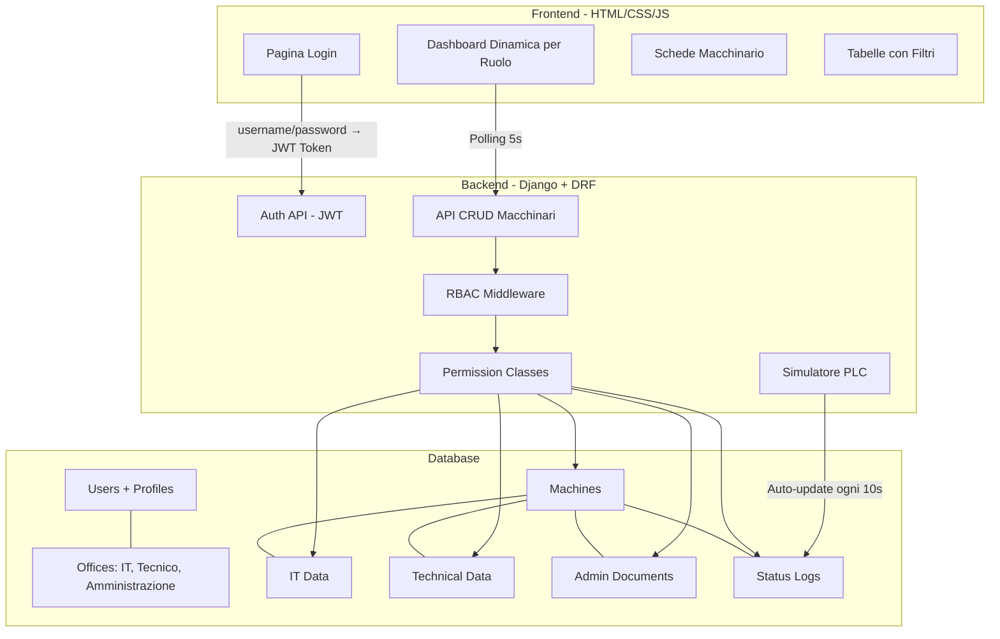
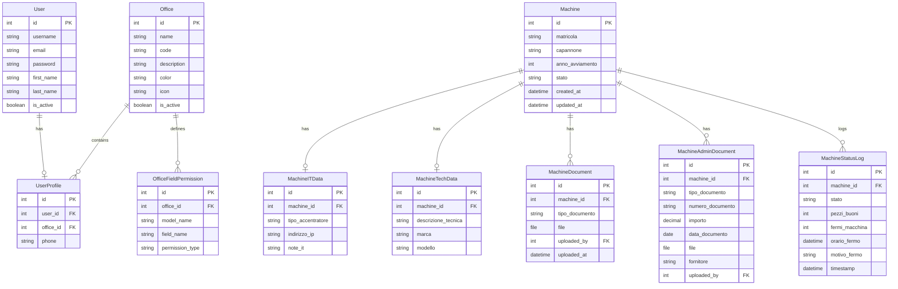
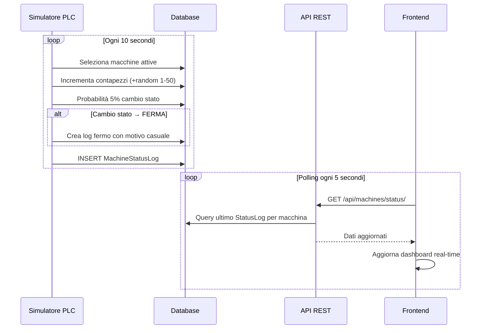

# Web App Gestionale Macchinari — Piano di Implementazione

> [!NOTE]
> Piano aggiornato con le risposte dell'utente. Pronto per approvazione e avvio Step 3 + Step 4.

---

## Step 1 — Stack Tecnologico

### Backend

| Componente | Tecnologia | Motivazione |
|---|---|---|
| **Framework** | **Django 5.x** | Framework "batteries-included", perfetto per app gestionali con ORM potente, admin integrato, e sistema auth/permission nativo |
| **API Layer** | **Django REST Framework (DRF)** | Standard de-facto per API RESTful in Django; supporto nativo per serializers, viewsets, permissions e filtri |
| **Autenticazione** | **Django Auth + SimpleJWT** | Login con username/password; token JWT per sessioni stateless |
| **Database** | **SQLite (dev) → PostgreSQL (prod)** | SQLite per sviluppo rapido locale; PostgreSQL per produzione |
| **File Storage** | **Django FileField + Media root** | Gestione upload documenti (manuali, certificazioni, fatture, bolle, ecc.) |
| **Filtri & Ricerca** | **django-filter** | Filtri rapidi sulle tabelle macchinari |
| **CORS** | **django-cors-headers** | Comunicazione frontend ↔ backend |
| **Simulatore PLC** | **Django Management Command + Threading** | Simulazione automatica aggiornamento stati e contapezzi |

### Frontend

| Componente | Tecnologia | Motivazione |
|---|---|---|
| **UI Framework** | **HTML5 + Vanilla CSS + JavaScript** | Interfaccia leggera e performante |
| **Design System** | **CSS Custom Properties + Grid/Flexbox** | Design system industriale custom con variabili CSS per temi e responsive |
| **Icone** | **Lucide Icons (CDN)** | Set di icone moderno e coerente |
| **Font** | **Inter (Google Fonts)** | Tipografia moderna ottimizzata per UI dashboard |
| **HTTP Client** | **Fetch API nativa** | Chiamate REST al backend |
| **Real-time Updates** | **Polling ogni 5s** | Aggiornamento automatico dati simulati dal PLC |

### Architettura Generale



### Struttura Progetto Django

```
rm_project/
├── manage.py
├── config/                        # Configurazione Django
│   ├── settings.py
│   ├── urls.py
│   └── wsgi.py
├── accounts/                      # App: Autenticazione e Profili
│   ├── models.py                  # UserProfile, Office, OfficeFieldPermission
│   ├── serializers.py
│   ├── views.py
│   ├── permissions.py             # Custom RBAC permission classes
│   └── urls.py
├── machines/                      # App: Gestione Macchinari
│   ├── models.py                  # Machine, ITData, TechData, AdminDoc, StatusLog
│   ├── serializers.py             # Serializers dinamici per ruolo
│   ├── views.py                   # ViewSets con filtri per ruolo
│   ├── filters.py                 # django-filter filtri rapidi
│   └── urls.py
│   ├── management/
│   │   └── commands/
│   │       └── simulate_plc.py   # Simulatore PLC (management command)
├── frontend/                      # App: Frontend statico
│   ├── static/
│   │   ├── css/
│   │   │   └── styles.css         # Design system industriale
│   │   └── js/
│   │       ├── app.js             # Entry point + routing
│   │       ├── auth.js            # Gestione JWT login/logout
│   │       ├── api.js             # Client API centralizzato
│   │       ├── dashboard.js       # Rendering dashboard per ruolo
│   │       └── components.js      # Componenti UI riutilizzabili
│   └── templates/
│       └── index.html             # SPA entry point
└── media/                         # Upload documenti
    └── documents/
```

---

## Step 2 — Schema del Database

### Diagramma ER



---

### Dettaglio Tabelle

#### 1. `User` — Django built-in `auth_user`
Tabella nativa di Django. Autenticazione con **username + password**.

---

#### 2. `UserProfile` — Profilo Utente Esteso

| Campo | Tipo | Vincoli | Descrizione |
|---|---|---|---|
| `id` | AutoField | PK | ID univoco |
| `user` | OneToOneField → User | UNIQUE, NOT NULL | Link al modello User |
| `office` | ForeignKey → Office | NOT NULL | Ufficio di appartenenza |
| `phone` | CharField(20) | NULL | Numero di telefono |

---

#### 3. `Office` — Uffici / Ruoli

| Campo | Tipo | Vincoli | Descrizione |
|---|---|---|---|
| `id` | AutoField | PK | ID univoco |
| `name` | CharField(100) | UNIQUE, NOT NULL | Nome ufficio |
| `code` | CharField(20) | UNIQUE, NOT NULL | Codice (es. `IT`, `TECH`, `ADMIN`) |
| `description` | TextField | NULL | Descrizione del ruolo |
| `color` | CharField(7) | NULL | Colore tema HEX (es. `#3B82F6`) |
| `icon` | CharField(50) | NULL | Nome icona Lucide |
| `is_active` | BooleanField | DEFAULT True | Ufficio attivo |

**Uffici iniziali:**

| Code | Nome | Colore | Icona |
|---|---|---|---|
| `IT` | Ufficio Informatico | `#3B82F6` (blu) | `monitor` |
| `TECH` | Ufficio Tecnico | `#F59E0B` (ambra) | `wrench` |
| `ADMIN` | Amministrazione | `#10B981` (verde) | `file-text` |

---

#### 4. `OfficeFieldPermission` — Permessi Campo per Ufficio (RBAC)

> [!IMPORTANT]
> Tabella chiave del sistema RBAC. Definisce per ogni ufficio quali campi sono in **READ** o **WRITE**.

| Campo | Tipo | Vincoli | Descrizione |
|---|---|---|---|
| `id` | AutoField | PK | ID univoco |
| `office` | ForeignKey → Office | NOT NULL | Ufficio |
| `model_name` | CharField(50) | NOT NULL | Nome modello (es. `Machine`) |
| `field_name` | CharField(50) | NOT NULL | Nome campo (es. `matricola`) |
| `permission_type` | CharField(5) | NOT NULL, CHOICES: `READ`/`WRITE` | Tipo permesso |

**Vincolo UNIQUE**: `(office, model_name, field_name)`

---

#### 5. `Machine` — Anagrafica Macchinari

| Campo | Tipo | Vincoli | Descrizione |
|---|---|---|---|
| `id` | AutoField | PK | ID univoco |
| `matricola` | CharField(50) | UNIQUE, NOT NULL | Matricola identificativa |
| `capannone` | CharField(50) | NOT NULL | Capannone (campo libero) |
| `anno_avviamento` | IntegerField | NULL | Anno di primo avviamento |
| `stato` | CharField(20) | NOT NULL, DEFAULT `attiva` | `attiva`, `in_manutenzione`, `ferma`, `dismessa` |
| `created_at` | DateTimeField | auto_now_add | Data creazione |
| `updated_at` | DateTimeField | auto_now | Ultimo aggiornamento |

---

#### 6. `MachineITData` — Dati IT

| Campo | Tipo | Vincoli | Descrizione |
|---|---|---|---|
| `id` | AutoField | PK | ID univoco |
| `machine` | OneToOneField → Machine | UNIQUE, NOT NULL | Macchinario |
| `tipo_accentratore` | CharField(10) | CHOICES: `IOX`, `RIO`, `PLC` | Tipo accentratore |
| `indirizzo_ip` | GenericIPAddressField | NULL | IP rete aziendale |
| `note_it` | TextField | NULL | Note IT |
| `updated_at` | DateTimeField | auto_now | Ultimo aggiornamento |
| `updated_by` | ForeignKey → User | NULL | Chi ha aggiornato |

---

#### 7. `MachineTechData` — Dati Tecnici

| Campo | Tipo | Vincoli | Descrizione |
|---|---|---|---|
| `id` | AutoField | PK | ID univoco |
| `machine` | OneToOneField → Machine | UNIQUE, NOT NULL | Macchinario |
| `descrizione_tecnica` | TextField | NULL | Descrizione tecnica |
| `marca` | CharField(100) | NULL | Marca |
| `modello` | CharField(100) | NULL | Modello |
| `anno_costruzione` | IntegerField | NULL | Anno costruzione |
| `note_tecniche` | TextField | NULL | Note tecniche |
| `updated_at` | DateTimeField | auto_now | Ultimo aggiornamento |
| `updated_by` | ForeignKey → User | NULL | Chi ha aggiornato |

---

#### 8. `MachineDocument` — Documenti Tecnici

| Campo | Tipo | Vincoli | Descrizione |
|---|---|---|---|
| `id` | AutoField | PK | ID univoco |
| `machine` | ForeignKey → Machine | NOT NULL | Macchinario |
| `tipo_documento` | CharField(30) | NOT NULL | Tipo documento |
| `nome_file` | CharField(255) | NOT NULL | Nome originale file |
| `file` | FileField | NOT NULL | File uploadato |
| `uploaded_by` | ForeignKey → User | NOT NULL | Chi ha caricato |
| `uploaded_at` | DateTimeField | auto_now_add | Data upload |
| `note` | TextField | NULL | Note |

**Tipi documento tecnico:**
- `USO_MANUTENZIONE` — Manuale d'uso e manutenzione
- `CERTIFICAZIONE_CE` — Certificazione CE
- `SCHEDA_VDR` — Scheda VDR
- `VERBALE_COLLAUDO` — Verbale di collaudo
- `ALTRO` — Altro

---

#### 9. `MachineAdminDocument` — Documenti Amministrativi (NUOVO)

> [!IMPORTANT]
> Tabella dedicata all'Ufficio Amministrazione per la gestione di fatture, bolle, ordini e pagamenti legati ai macchinari.

| Campo | Tipo | Vincoli | Descrizione |
|---|---|---|---|
| `id` | AutoField | PK | ID univoco |
| `machine` | ForeignKey → Machine | NOT NULL | Macchinario |
| `tipo_documento` | CharField(30) | NOT NULL | Tipo documento amministrativo |
| `numero_documento` | CharField(50) | NOT NULL | Numero fattura/bolla/ordine |
| `data_documento` | DateField | NOT NULL | Data del documento |
| `importo` | DecimalField(10,2) | NULL | Importo in € |
| `fornitore` | CharField(200) | NULL | Nome fornitore |
| `descrizione` | TextField | NULL | Descrizione/note |
| `file` | FileField | NULL | Scansione/PDF del documento |
| `uploaded_by` | ForeignKey → User | NOT NULL | Chi ha caricato |
| `uploaded_at` | DateTimeField | auto_now_add | Data upload |

**Tipi documento amministrativo:**
- `FATTURA` — Fattura componenti/macchinario
- `BOLLA_TRASPORTO` — Bolla di trasporto (consegna macchinario)
- `ORDINE_ACQUISTO` — Ordine di acquisto
- `COPIA_PAGAMENTO` — Copia pagamento effettuato
- `ALTRO_ADMIN` — Altro documento amministrativo

---

#### 10. `MachineStatusLog` — Log Stato e Contatori (Simulato da PLC)

| Campo | Tipo | Vincoli | Descrizione |
|---|---|---|---|
| `id` | AutoField | PK | ID univoco |
| `machine` | ForeignKey → Machine | NOT NULL | Macchinario |
| `stato` | CharField(20) | NOT NULL | Stato registrato |
| `pezzi_buoni` | IntegerField | DEFAULT 0 | Contatore pezzi buoni |
| `fermi_macchina` | IntegerField | DEFAULT 0 | Numero fermi |
| `orario_fermo` | DateTimeField | NULL | Orario del fermo |
| `motivo_fermo` | CharField(200) | NULL | Motivo del fermo |
| `timestamp` | DateTimeField | auto_now_add | Timestamp log |

> [!NOTE]
> **Simulatore PLC**: Un management command Django (`simulate_plc`) aggiornerà automaticamente questa tabella ogni ~10 secondi, simulando:
> - Incremento progressivo del contapezzi buoni
> - Cambi di stato casuali (attiva ↔ ferma ↔ in_manutenzione)
> - Generazione eventi di fermo con motivi casuali (guasto, manutenzione programmata, cambio utensile, ecc.)

---

## Matrice Permessi RBAC — Riepilogo Completo

| Campo | 🖥️ IT | 🔧 Tecnico | 📋 Amministrazione |
|---|---|---|---|
| **Machine.matricola** | ✏️ Write | ✏️ Write | 👁️ Read |
| **Machine.capannone** | 👁️ Read | ✏️ Write | 👁️ Read |
| **Machine.anno_avviamento** | 👁️ Read | ✏️ Write | 👁️ Read |
| **Machine.stato** | 👁️ Read | 👁️ Read | 👁️ Read |
| **MachineITData.tipo_accentratore** | ✏️ Write | ❌ — | ❌ — |
| **MachineITData.indirizzo_ip** | ✏️ Write | 👁️ Read | ❌ — |
| **MachineStatusLog.pezzi_buoni** | 👁️ Read | ❌ — | ❌ — |
| **MachineStatusLog.fermi_macchina** | 👁️ Read | ❌ — | ❌ — |
| **MachineStatusLog.orario_fermo** | 👁️ Read | ❌ — | ❌ — |
| **MachineDocument.*** | ❌ — | ✏️ Write | 👁️ Read |
| **MachineAdminDocument.*** | ❌ — | ❌ — | ✏️ Write |

---

## Simulatore PLC — Dettaglio Tecnico



**Motivi di fermo simulati:**
- Guasto meccanico
- Guasto elettrico
- Manutenzione programmata
- Cambio utensile
- Mancanza materiale
- Pulizia programmata

---

## Piano di Esecuzione — Step 3 e Step 4

### Step 3 — Backend (in ordine)
1. Inizializzazione progetto Django + installazione dipendenze
2. Modelli `accounts` (User, UserProfile, Office, OfficeFieldPermission)
3. Modelli `machines` (Machine, ITData, TechData, Document, AdminDocument, StatusLog)
4. Custom Permission Classes RBAC
5. Serializers dinamici (cambiano campi in base al ruolo)
6. ViewSets + Filtri
7. URL routing API
8. Management command `simulate_plc`
9. Fixture dati iniziali (uffici, utenti demo, macchinari demo)

### Step 4 — Frontend (in ordine)
1. Design system CSS (variabili, layout, componenti base)
2. Pagina Login
3. Dashboard con header, sidebar, area contenuto
4. Vista tabella macchinari con filtri
5. Scheda dettaglio macchinario (card) con sezioni per ruolo
6. Form di inserimento/modifica con campi dinamici per ruolo
7. Sezione upload documenti (tecnici e amministrativi)
8. Indicatori real-time stato macchina (polling)
9. Responsive design per tablet

---

## Verification Plan

### Automated Tests
```bash
python manage.py test accounts
python manage.py test machines
```
- Test modelli: validazione campi, vincoli, relazioni
- Test RBAC: verifica permessi per ogni ruolo
- Test API: CRUD completo per ogni endpoint
- Test serializer: campi corretti per ogni ruolo

### Manual Verification
- Login con 3 utenti demo (IT, Tecnico, Amministrazione)
- Verifica dashboard differenziata per ruolo
- Test CRUD con permessi corretti/negati
- Upload documenti
- Verifica simulatore PLC e aggiornamento real-time
- Test responsive su viewport tablet (768px) e desktop (1280px)

### Utenti Demo Previsti

| Username | Password | Ufficio |
|---|---|---|
| `admin_it` | `demo1234` | Ufficio Informatico |
| `admin_tech` | `demo1234` | Ufficio Tecnico |
| `admin_amm` | `demo1234` | Amministrazione |
